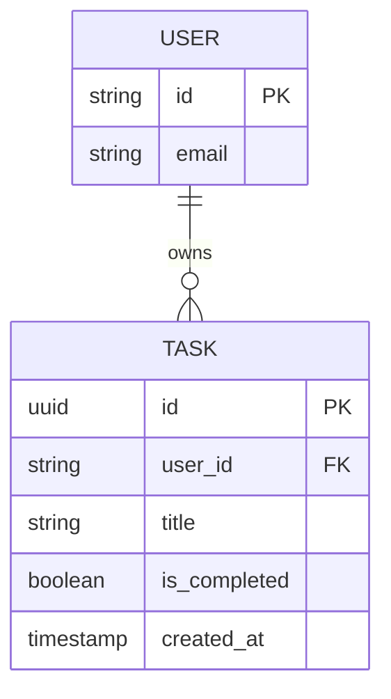

# Database Schema Specification

## Overview
This document defines the database schema for Phase-2 of the Hackathon Todo App using SQLModel and targeting Neon Serverless PostgreSQL.

## Core Principles
1. **User Isolation**: Every record (except global config) MUST be linked to a `User` via `user_id`.
2. **Performance**: Indexes on frequently queried and filtered columns.
3. **Auditability**: Automatic `created_at` and `updated_at` timestamps.

## Entity Definitions

### 1. User Table (Managed by Better Auth)
The `User` table stores identity information. While Better Auth handles the core fields, we maintain a SQLModel representation for relationships.

| Column | Type | Constraints | Description |
| :--- | :--- | :--- | :--- |
| `id` | `UUID` / `String` | Primary Key | Unique identifier (from Better Auth) |
| `email` | `String` | Unique, Not Null | User email address |
| `name` | `String` | Optional | User display name |
| `created_at` | `DateTime` | Not Null | Creation timestamp |

### 2. Task Table
The core entity for the Todo application.

| Column | Type | Constraints | Description |
| :--- | :--- | :--- | :--- |
| `id` | `UUID` | Primary Key, Default UUID | Unique task ID |
| `user_id` | `UUID` / `String` | Foreign Key (User.id) | Owner of the task |
| `title` | `String(255)` | Not Null | Task summary |
| `description` | `Text` | Optional | Detailed notes |
| `is_completed` | `Boolean` | Not Null, Default `False` | Completion status |
| `priority` | `Integer` | Default `1` (Normal) | 0: Low, 1: Normal, 2: High |
| `created_at` | `DateTime` | Not Null | Record creation time |
| `updated_at` | `DateTime` | Not Null | Record last update time |

## Indexes & Constraints

### Indexes
- **`ix_task_user_id`**: For fast filtering of tasks by owner.
- **`ix_task_is_completed`**: To optimize views of pending vs. completed tasks.
- **`ix_task_user_status`**: Composite index on `(user_id, is_completed)` for primary application views.

### Constraints
- **Foreign Key**: `task.user_id` -> `user.id` (ON DELETE CASCADE).
- **Check**: `priority` should be within standard range (0-2).

## Relationship Diagram

## Migration Strategy
- Use **Alembic** for schema versioning.
- Phase-2 migrations will handle initial table creation.

---
*Created by sqlmodel_schema_builder*
